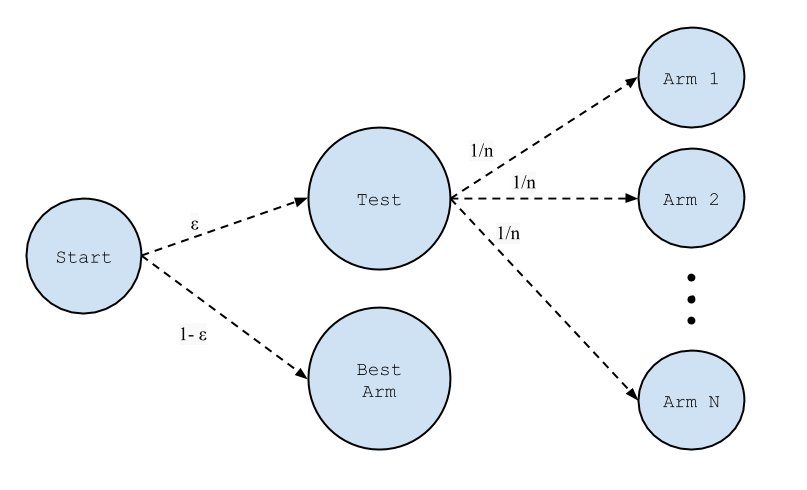
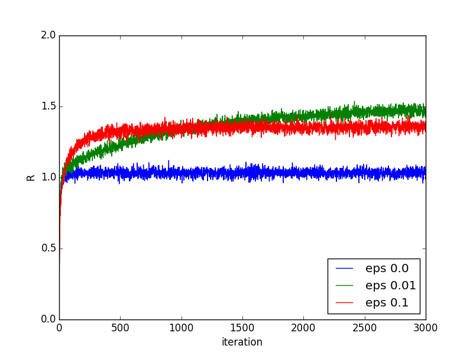
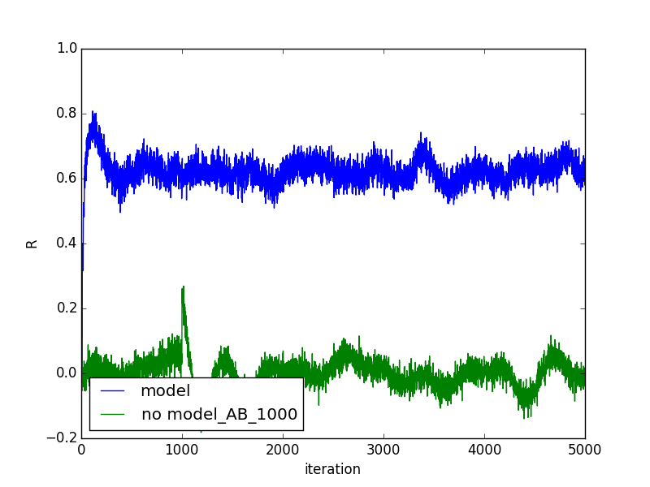
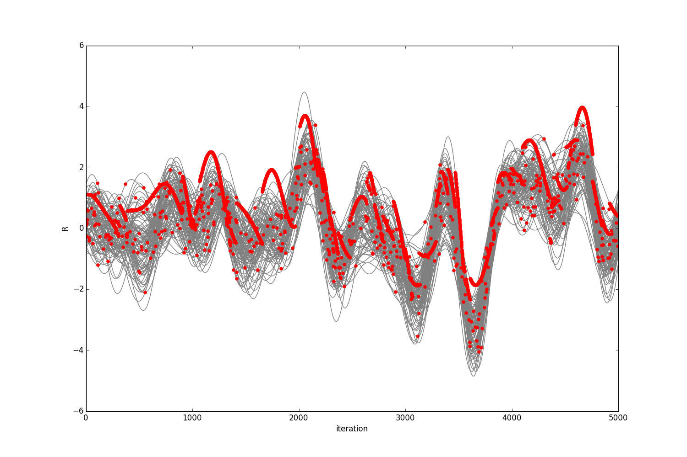

# Multi-Armed Bandits

## Who should care?

Anyone who is involved in testing. Whether you are testing creatives for a marketing campaign, pricing strategies, website designs, or even pharmaceutical treatments, multi-armed bandit algorithms can help you increase the accuracy of your tests while cutting down costs and automating your process.

## Where does the name come from?

A typical slot machine is a device in which the player pulls a lever arm and receives rewards at some expected rate. Because the expected rate is typically negative, these machines are sometimes referred to as "one-armed bandits". By analogy, a "multi-armed bandit" is a machine in which there are multiple lever arms to pull, each one of which may pay out at a different expected rate.

The "multi-armed bandit" problem refers to the challenge of constructing a strategy for pulling the levers when one has no prior knowledge of the payout rate for any of the levers. Therefore, one must strike a balance between *exploring* each of the levers in order to determine their value, while *exploiting* one's current knowledge in order to favor high paying levers.

This question has been the subject of active research since the 1950s, and many <a href="https://en.wikipedia.org/wiki/Multi-armed_bandit">variations</a> have been studied.

## What do slot machines have to do with marketing, pricing, website design, etc?

For any testing problem, you can make an analogy with the multi-armed slot machine by thinking of each test case as an "arm". Considering the multi-armed bandit problem is equivalent to looking for an optimal strategy for efficiently testing each case of interest for your problem.

## Connection to A-B Testing

Traditional A-B testing can be thought of as a special case of the multi-armed bandit problem, in which we choose to pursue a strategy of pure exploration in the initial testing phase, followed by a period of pure exploitation in which we choose the most valuable "arm" 100% of the time.

If the exploitation phase can be assumed to be much longer than the exploration phase, this approach is usually reasonable, as the wasted resources during the exploration are insignificant relative to the total rewards. However, in cases where the cost of the exploration phase is non-negligible, or in cases in which arm values are changing dynamically on short enough timescales that it becomes impractical to repeatedly perform new A-B tests, alternative approaches are needed.

## When to Use Bandits

Bandits are appropriate any time that testing is required. As discussed above, traditional A-B testing can be thought of as a special case of the multi-bandit problem, but it is certainly not the optimal way of balancing exploration with exploitation. Therefore, by definition, it cannot hurt to reimagine any A-B testing framework as a multi-armed bandit problem. Moreover, significant gains may be obtained by switching to a more sophisticated testing algorithm such as epsilon-greedy. That said, the degree of improvements that can be expected depend on several factors.

### Short term applications

When the window of time to exploit is less than or equal to the length of time required to complete an A-B test, large gains can be made by using a multi-armed bandit approach in order to begin exploiting as early as possible. This can occur, for example, in short term holiday promotions.

### Capturing dynamic changes

When the phenomenon being tested changes significantly enough that the results of an A-B test can become invalid over time, multi-arm bandits provide an alternative to repeatedly retesting. By continuously exploring, one can maintain an optimal strategy.

### Automating testing process

Multi-armed bandits can also provide value by eliminating the need for repeated intervention by analysts in order to perform repeated A-B tests.

## Epsilon-Greedy

<figure>
  
</figure>

The most straightforward algorithm for continuously balancing exploration with exploitation is called "epsilon-greedy". A schematic diagram for the algorithm is shown above. Here, we pull a randomly chosen arm a fraction &epsilon; of the time. The other 1-&epsilon; of the time, we pull the arm which we estimate to be the most profitable. As each arm is pulled and rewards are received, our estimates of arm values are updated. This method can be thought of a a continuous testing setup, where we devote a fraction &epsilon; of our resources to testing.

The following python code implements a simple 10-Armed Bandit using the epsilon-greedy algorithm. The payout rate of the arms are normally distributed with mean=0 and sigma=1. Gaussian noise is also added to the rewards, also with mean=0 and sigma=1. This setup mirrors that of <a href="https://webdocs.cs.ualberta.ca/~sutton/book/the-book.html">Sutton and Barto</a>, Section 2.1.

    import numpy as np

    class Bandit:
        def __init__(self):
            self.arm_values = np.random.normal(0,1,10)
            self.K = np.zeros(10)
            self.est_values = np.zeros(10)

        def get_reward(self,action):
            noise = np.random.normal(0,1)
            reward = self.arm_values[action] + noise
            return reward

        def choose_eps_greedy(self,epsilon):
            rand_num = np.random.random()
            if epsilon>rand_num:
                return np.random.randint(10)
            else:
                return np.argmax(self.est_values)

        def update_est(self,action,reward):
            self.K[action] += 1
            alpha = 1./self.K[action]
            self.est_values[action] += alpha * (reward - self.est_values[action])  # keeps running average of rewards

Now we can run a simple experiment using our bandit in order to see how &epsilon; controls the tradeoff between exploration and exploitation. A single experiment consists of pulling the arm Npulls times for a given 10 armed bandit.

    def experiment(bandit,Npulls,epsilon):
        history = []
        for i in range(Npulls):
            action = bandit.choose_eps_greedy(epsilon)
            R = bandit.get_reward(action)
            bandit.update_est(action,R)
            history.append(R)
        return np.array(history)

 We perform experiments in which we execute a sequence of 3000 pulls, updating our estimate of the arm values and keeping track of the reward history. We average the results over 500 such experiments, and we repeat for 3 different values of &epsilon; for comparison.

    Nexp = 2000
    Npulls = 3000

    avg_outcome_eps0p0 = np.zeros(Npulls)
    avg_outcome_eps0p01 = np.zeros(Npulls)
    avg_outcome_eps0p1 = np.zeros(Npulls)

    for i in range(Nexp):
        bandit = Bandit()
        avg_outcome_eps0p0 += experiment(bandit,Npulls,0.0)
        bandit = Bandit()
        avg_outcome_eps0p01 += experiment(bandit,Npulls,0.01)
        bandit = Bandit()
        avg_outcome_eps0p1 += experiment(bandit,Npulls,0.1)

    avg_outcome_eps0p0 /= np.float(Nexp)
    avg_outcome_eps0p01 /= np.float(Nexp)
    avg_outcome_eps0p1 /= np.float(Nexp)

    # plot results
    import matplotlib.pyplot as plt

    plt.plot(avg_outcome_eps0p0,label="eps = 0.0")
    plt.plot(avg_outcome_eps0p01,label="eps = 0.01")
    plt.plot(avg_outcome_eps0p1,label="eps = 0.1")
    plt.ylim(0,2.2)
    plt.legend()
    plt.show()
<figure>
  
</figure>

We compare the evolution of expected reward vs iteration for several values of &epsilon;. Choosing &epsilon;=0 is equivalent to a purely greedy algorithm, in which we always choose the arm which is believed to be most rewarding. In this case, the expected value very quickly increases, as it commits to one arm and stops exploring, but the expected value is relatively low as it doesn't attempt to search for better options at all. Choosing &epsilon;=0.1 leads to higher expected rewards, but it takes approximately 500 iterations before leveling off. Choosing &epsilon;=0.01 leads to a higher expected reward in the long term because fewer pulls are wasted continuing to explore after finding the best arm, but it takes much longer to reach this level.

## Contextual Bandit

In the bandit problem described above, it is assumed that nothing is known about each arm other than what we have learned from prior pulls. We can relax this assumption and assume that for each arm there is a d-dimensional "context" vector. For example, if each arm represents a digital ad, the features in these vectors may correspond to things like banner size, web browser type, font color, etc. We can now model the value of each arm using these context vectors as well as past rewards in order to inform our choice of which arm to pull. This scenario is known as the contextual bandit problem.

<figure>
  
  
</figure>

In the figure above, we show results of an experiment similar to the Epsilon-Greedy experiment. In this case, however, we let there be 100 arms, and the value of each arm is equal to linear combination of 100 context features. The value of each context feature is drawn from a uniform distribution between 0 and 1. The coefficients of these linear combinations are now allowed to vary sinusoidally in time, with random frequency and phase. The resulting arm values vary periodically and are represented by the grey curves in the plot on the right hand side. Thus, we see that classical Bandit techniques will fail, as the "best arm" is constantly changing. Moreover, because there are a large number of arms, it is impractical to test them all quickly enough to keep up with the fact that they are changing. In order to gain information quickly enough and exploit our knowledge, we must take advantage of contextual information.

To do this, we model the values of the arms using a linear regression, continuously updating the fit using stochastic gradient descent with constant learning rate. We perform the experiment 2000 times and plot expected rewards in the left-hand plot. The green curve is the result of a classical epsilon-greedy algorithm with no context taken into account. As expected, the expected rewards are essentially zero, as we do not take into account the fact that the value of the arms are changing. The green curve shows the result of the contextual bandit described above. In this case, the rewards increase significantly. We also plot the rewards received for the contextual bandit in red dots on the right-hand plot. Here, we see the choice of arm jumping as the relative value of the arms switches.

## Randomized Probability Matching - A Bayesian Approach

There is a nice alternative to the epsilon-greedy algorithm known as Randomized Probability Matching. The technique is described in detail [here](http://www.economics.uci.edu/~ivan/asmb.874.pdf). Here is a summary of the approach.

1. We assume a "prior" probability distribution for the expected reward of each arm in the bandit.

2. We use these distributions to compute the probability that each arm is the best arm.

3. We chose which arm to pull next. The probability of a given arm being chosen is set to be equal to the probability that it is the best arm.

4. Measure the reward received and update our "posterior" probability distribution for the expected reward of each arm.

5. Iterate steps 2-4

## Twitter Demo

The following demo using Twitter data further illustrates how this works. Imagine that we are running a political ad campaign. Each time an individual Twitter user sends a tweet with the word "president" or "election" in it, we serve them an imaginary ad. We have three distinct ads we can choose from. A "hillary clinton" ad, a "bernie sanders" ad, and a "donald trump" ad. We further imagine that the individual has "clicked" on our ad if his tweet contains a reference to the corresponding candidate name. We will use randomized probability matching to continuously update our estimates of the probability distribution for the click rate of each ad. The video below shows how these distributions evolve in real time as tweets are collected. The x-axis represents click-rate, and the y-axis represents probability density. Note that this video has been sped up by 8x.

There are several interesting things to note about this demo:

1. Each distribution starts out broad and narrows as we gather more data
2. Each time the curves change, a new ad was served. The video clearly shows that the "winning" ad is being served more often.
3. The losing ads are sampled less often, and thus there distributions remain broad. This is a good thing, because we don't need to know the click-rate of the losing ads with great accuracy as long as we are confident that they are not the winner.

For the code used to generate this demo, see this [repo](https://github.kdc.capitalone.com/AdvancedResearch/TwitterBandit) on github.

## Relation to Reinforcement learning

The multi-armed Bandit problem can be thought of as a special case of the more general Reinforcement Learning problem. The general problem is beyond the scope of this post, but is an exciting area of machine learning research. The Advanced Research team in Capital One Data Labs has been working on a Reinforcement Learning software package. To learn more, check out this excellent  <a href="https://webdocs.cs.ualberta.ca/~sutton/book/the-book.html">book</a> by Sutton and Barto.
